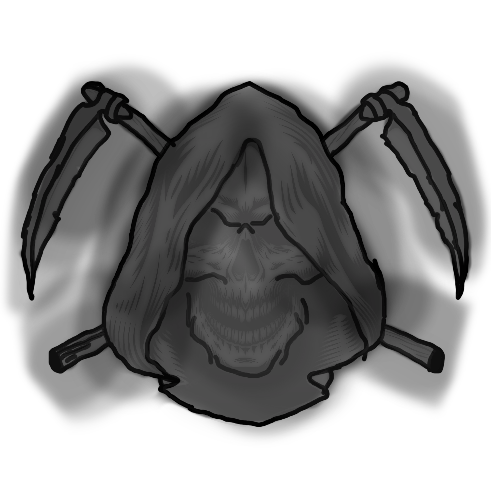
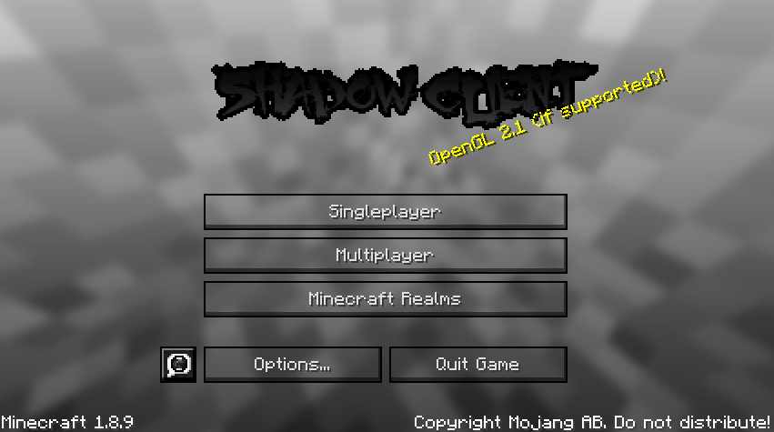
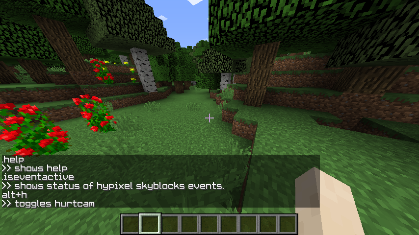

<h1 style="background: -webkit-linear-gradient(#eee, #333);  -webkit-background-clip: text;-webkit-text-fill-color: transparent;">Shadowclient</h1>

Shadowclient is a minecraft client that tries to makes pvp more fun

</img>
</img>
<h1>Features:</h1>

autoSprint - Sprints automaticly when you walk
 
(hypixel skyblock) Jacobs Farming event status check - checks if a farming event is ongoing or season of jerry is ongoing (/isevenactive)
 
hurtcam - toggles hurtcam on / off (default hurtcam on) alt+h
 
clear shadows - transparent shadows > more visibility in dark caves for example
 
help - shows list of availible commands (.help)

 
<h1>how to install</h1>
zip:drag over the shadowclient folder from the zip to the versions folder
 
installer:run program fill in the textboxes and click the install button
<h1>Screenshots</h1>
</img>
</img>
<h1>info / notes:</h1>

  this is a one person project as of 08/07/23
   
  also this project is in alpha as of 08/07/23
   
  season of jerry isnt tested yet

<h1>links:</h1>
<a href="http://shadowstudios.rf.gd/" style="color: blue;">our website</a> 
<a href="https://shadowdevhere.itch.io/" style="color: blue;">our itch.io</a>
